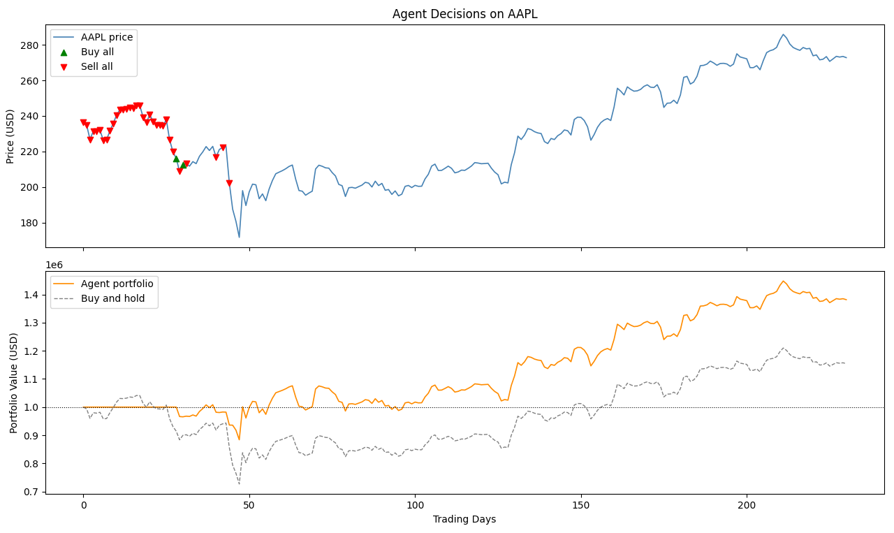
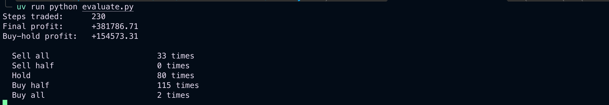

# StockSystem

Reinforcement Learning environment for stock trading. A DQN agent built manually with PyTorch learns to buy, sell, or hold AAPL stock to maximize portfolio profit over a training period of 500 episodes.

---

# StockSystem (Espanol)

Ambiente de aprendizaje por refuerzo para operar en el mercado de acciones. Un agente DQN construido manualmente con PyTorch aprende a comprar, vender o mantener acciones de AAPL para maximizar la ganancia del portafolio durante 500 episodios de entrenamiento.

---

## Environment Design / Diseno del Ambiente

| Component | Description |
|-----------|-------------|
| State | 6 historical closing prices + invested value + available capital (8 floats) |
| Actions | Sell all, Sell half, Hold, Buy half, Buy all (Discrete 5) |
| Reward | Normalized change in total portfolio value per step |
| Penalties | Transaction fee (0.1%), hold penalty when idle, terminal loss penalty |

---

## Results / Resultados

Trained for 500 episodes on real AAPL data (2020-2025, 1507 trading days). Evaluated on a 230-day window.

| Strategy | Profit |
|----------|--------|
| DQN Agent | +$381,786.71 |
| Buy and Hold | +$154,573.31 |
| Agent advantage | +$227,213.40 |

### Agent decisions / Decisiones del agente

| Action | Count |
|--------|-------|
| Sell all | 33 |
| Sell half | 0 |
| Hold | 80 |
| Buy half | 115 |
| Buy all | 2 |

### Evaluation chart / Grafico de evaluacion



### Terminal output / Salida en terminal



---

## Project Structure / Estructura del Proyecto

```
stock_env.py                    - Custom Gymnasium environment
agent.py                        - MLP network, replay buffer, DQN agent
train.py                        - Training loop (500 episodes)
evaluate.py                     - Evaluation and chart generation
download/download_stock_info.py - Downloads historical data from Yahoo Finance
test/test.py                    - Environment test with random actions
data/                           - Stock price CSV files
images/                         - Result charts
model.pth                       - Trained model weights
```

---

## Setup / Instalacion

```bash
uv sync
```

## Usage / Uso

```bash
# Download stock data / Descargar datos
uv run python download/download_stock_info.py

# Test environment / Probar el ambiente
uv run python test/test.py

# Train the agent / Entrenar el agente
uv run python train.py

# Evaluate and generate chart / Evaluar y generar grafico
uv run python evaluate.py
```

---

## Tech Stack

- Python 3.11+
- Gymnasium
- PyTorch
- NumPy
- Pandas
- Matplotlib
- yfinance
