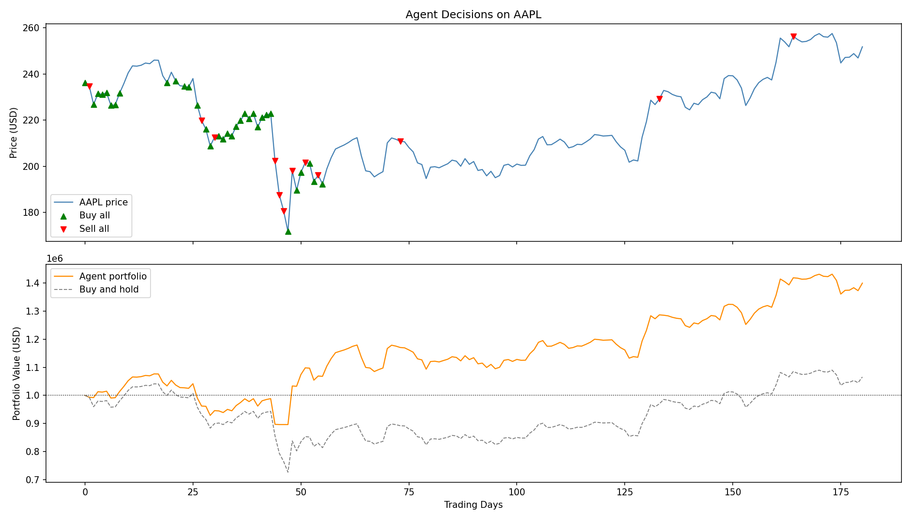
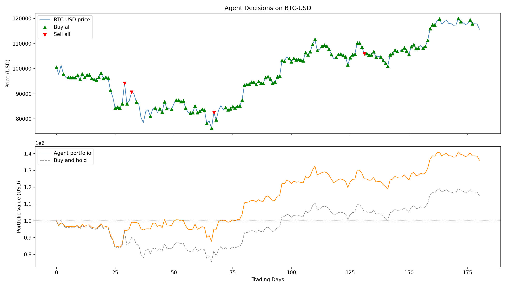
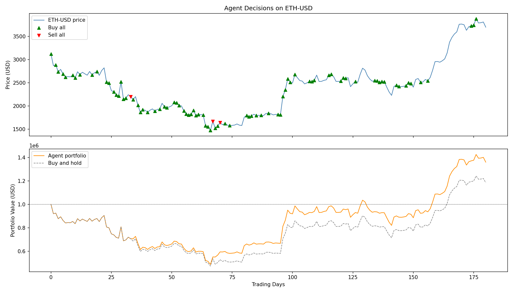
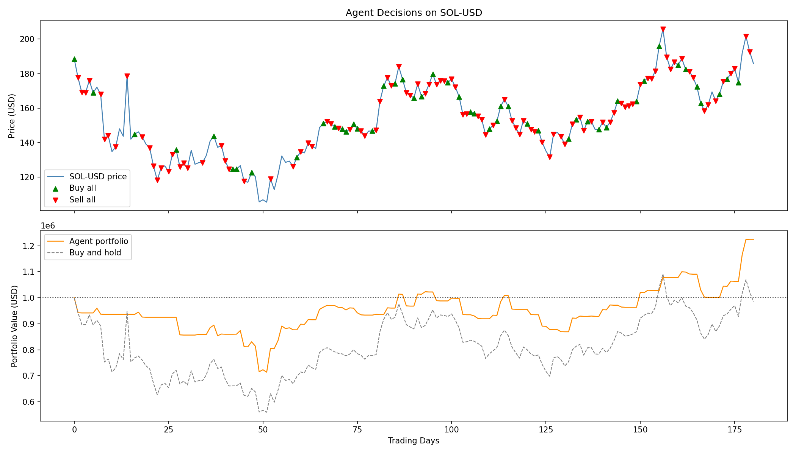
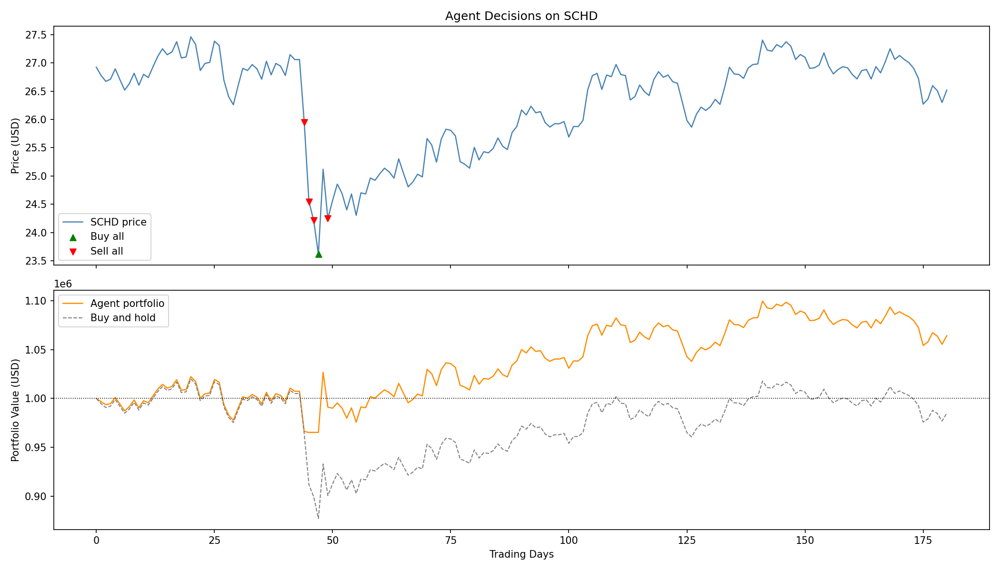

# StockSystem

Reinforcement Learning environment for stock and crypto trading. A DQN agent built manually with PyTorch learns to buy, sell, or hold assets to maximize portfolio profit. Trained and evaluated on 5 assets across different volatility profiles.

---

# StockSystem (Espanol)

Ambiente de aprendizaje por refuerzo para operar en el mercado de acciones y criptomonedas. Un agente DQN construido manualmente con PyTorch aprende a comprar, vender o mantener activos para maximizar la ganancia del portafolio. Entrenado y evaluado en 5 activos con diferentes perfiles de volatilidad.

---

## Environment Design / Diseno del Ambiente

| Component | Description |
|-----------|-------------|
| State | 5 daily percentage returns + invested ratio + cash ratio (7 floats) |
| Actions | Sell all, Sell half, Hold, Buy half, Buy all (Discrete 5) |
| Reward | Normalized change in total portfolio value per step |
| Penalties | Transaction fee (0.1%), hold penalty (1% per step), terminal loss penalty |
| Episode length | 60 trading days (training), 180 trading days (evaluation) |

The observation uses percentage returns instead of raw prices so the agent learns scale-invariant patterns that transfer across assets with very different price magnitudes.

El estado usa retornos porcentuales en lugar de precios absolutos, lo que permite al agente aprender patrones independientes de la escala que funcionan en activos con magnitudes de precio muy diferentes.

---

## Reward Function / Funcion de Recompensa

The reward is computed at every step and has three components:

**1. Mark-to-market return (every step)**

```
R = (total_value_t - total_value_t-1) / initial_capital
```

The total portfolio value is `shares * new_price + available_capital`. Dividing by `initial_capital` normalizes the reward so that a $10,000 gain on a $1,000,000 portfolio gives `+0.01` regardless of the asset's price level. This is the main learning signal — the agent is rewarded for growing the portfolio and penalized when it shrinks.

**2. Hold penalty (every step the agent holds)**

```
R -= 0.01  (if action == Hold)
```

Applied every time the agent chooses Hold (action 2), regardless of whether it has shares or not. This forces the agent to actively manage its position rather than staying passive. Without this penalty the agent learns that doing nothing is always safe.

**3. Terminal loss penalty (only at episode end)**

```
R -= (1 - total_value / initial_capital)  if total_value < 90% of initial_capital
```

Applied only at the last step of the episode if the agent lost more than 10% of the starting capital. The penalty scales with the size of the loss — a 20% loss hurts more than an 11% loss. This discourages the agent from taking excessive risks that lead to large drawdowns.

---

La recompensa se calcula en cada paso y tiene tres componentes:

**1. Retorno mark-to-market (cada paso)**

El agente recibe una recompensa positiva si el valor total del portafolio subio y negativa si bajo. Se normaliza dividiendo por el capital inicial para que sea independiente de la magnitud del activo.

**2. Penalizacion por inaccion (cada paso que el agente no actua)**

Se aplica `-0.01` cada vez que el agente elige Hold. Esto evita que el agente aprenda a no hacer nada como estrategia segura.

**3. Penalizacion terminal por perdida grande (solo al final del episodio)**

Si al terminar el episodio el portafolio vale menos del 90% del capital inicial, se aplica una penalizacion proporcional al tamano de la perdida.

---

## Results / Resultados

Trained for 2000 episodes per asset (60-day windows). Evaluated on a 180-day window.

| Asset | Agent Profit | Buy-Hold Profit | Agent Advantage | Profit Factor | Max Drawdown | Sharpe Ratio |
|-------|-------------|-----------------|-----------------|---------------|--------------|--------------|
| AAPL | +$399,819 | +$65,641 | +$334,178 | 1.38 | 16.76% | 1.59 |
| BTC-USD | +$360,920 | +$150,039 | +$210,881 | 1.31 | 15.62% | 1.48 |
| ETH-USD | +$360,738 | +$185,477 | +$175,261 | 1.20 | 51.42% | 0.98 |
| SOL-USD | +$223,467 | -$14,564 | +$238,031 | 1.25 | 28.60% | 0.91 |
| SCHD | +$64,263 | -$15,057 | +$79,320 | 1.11 | 5.59% | 0.63 |

All agents beat buy-and-hold on their respective assets. AAPL and BTC show the best risk-adjusted performance (Sharpe > 1.4, Drawdown < 17%). ETH achieved high profit but with a significant 51% drawdown during the evaluation period. SCHD shows the most conservative behavior with the lowest drawdown (5.59%), reflecting the defensive nature of the dividend ETF.

Todos los agentes superaron la estrategia de comprar y mantener en sus activos respectivos. AAPL y BTC presentan el mejor desempeno ajustado por riesgo (Sharpe > 1.4, Drawdown < 17%). ETH logro alta ganancia pero con una caida maxima del 51% durante el periodo de evaluacion. SCHD muestra el comportamiento mas conservador con la menor caida maxima (5.59%), reflejando la naturaleza defensiva del ETF de dividendos.

---

## Evaluation Charts / Graficos de Evaluacion







---

## Project Structure / Estructura del Proyecto

```
stock_env.py                    - Custom Gymnasium environment
agent.py                        - MLP network, replay buffer, DQN agent
train.py                        - Training loop (2000 episodes per asset)
evaluate.py                     - Evaluation and chart generation
download/download_stock_info.py - Downloads historical data from Yahoo Finance
test/test.py                    - Environment test with random actions
data/                           - Stock price CSV files
images/                         - Result charts
```

---

## Setup / Instalacion

```bash
uv sync
```

## Usage / Uso

```bash
# Download stock data / Descargar datos
uv run python download/download_stock_info.py

# Test environment / Probar el ambiente
uv run python test/test.py

# Train the agent / Entrenar el agente
uv run python train.py

# Evaluate and generate charts / Evaluar y generar graficos
uv run python evaluate.py
```

---

## Tech Stack

- Python 3.11+
- Gymnasium
- PyTorch
- NumPy
- Pandas
- Matplotlib
- yfinance
